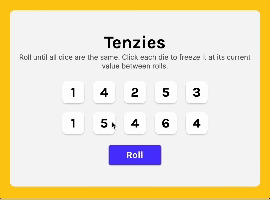

# Tenzies (React Capstone Project)

## Objective
React-based game of tenzies that allows a user to roll dice and hold them in place until all 10 die are the same value. Once the game is over, and you have won, confetti will drop and you can start a new game.

## Visual

**Gameplay of Tenzies**

